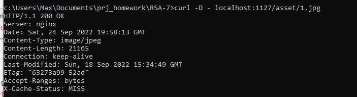
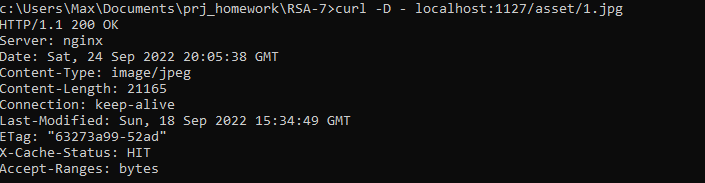
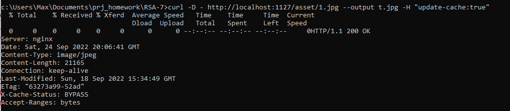

Init
>docker-compose build && docker-compose up

Два запити для того щоб спрацював кеш

>curl -D - http://localhost:1127/asset/1.jpg
> 

Третій запити вже з кешу
>curl -D - http://localhost:1127/asset/1.jpg
> 

Оновлення кешу
>curl -D - http://localhost:1127/asset/1.jpg -H "update-cache:true"
> 